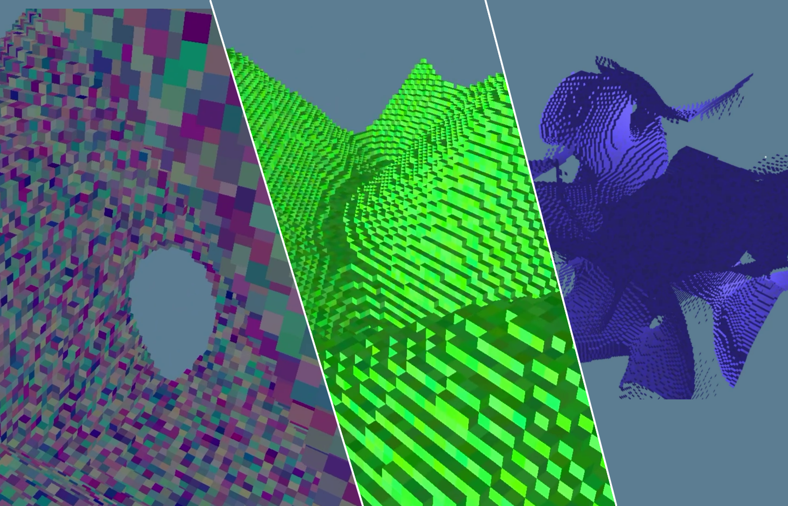

# first_voxel_engine
This is my first ever voxel engine written for Rust, using [wgpu-rs](https://github.com/gfx-rs/wgpu-rs) as rendering backend.

I will not accept pull requests as I want people watching my video about creating this (here: https://youtu.be/96ht7rd3Y5I)

to have easy access to the source code at this projects initial state.

so what is the initial state?
Working endless voxel generation, but not optimized!
Only one form of world generation is provided, endless grass cave one.

